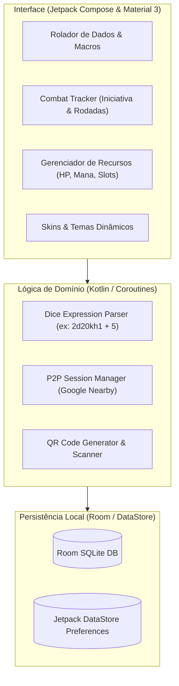
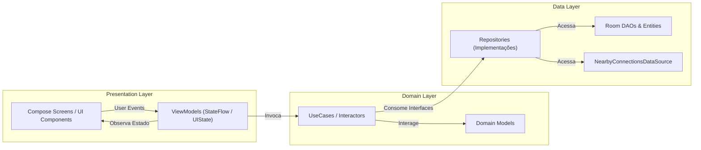

# Grimório RPG — Documentação de Arquitetura & Especificação Técnica

> **Plataforma:** Android Nativo (Kotlin 2.x + Jetpack Compose)  
> **Paradigma:** 100% Client-Side / Offline-First / Zero Custo de Nuvem  
> **Status:** Especificação Aprovada para Desenvolvimento  

---

## 1. Visão Geral do Produto

### 1.1 Proposta de Valor
O **Grimório RPG** é um aplicativo assistente para jogadores e mestres de RPG de mesa (D&D 5e, Tormenta20, Pathfinder, Call of Cthulhu, etc.), projetado para operar **sem nenhuma dependência de internet ou servidores na nuvem**. Todos os dados ficam salvos localmente no dispositivo (Room Database) e a comunicação entre pessoas na mesma mesa acontece via **P2P direto** (Google Nearby Connections via Bluetooth / Wi-Fi Direct) ou **códigos QR**.

### 1.2 Premissas de Custo e Infraestrutura
* **Custo Mensal de Servidores:** R$ 0,00.
* **Custo de Publicação:** Apenas a taxa única de registro de desenvolvedor na Google Play Console ($25 USD vitalício).
* **Dependências Externas:** Nenhuma API paga, sem plano de dados necessário.

---

## 2. Escopo dos Módulos Funcionais



### Módulo 1: Motor de Rolagem de Dados (Dice Engine)
* **Dados Padrão:** d4, d6, d8, d10, d12, d20, d100, dF (Fudge/Fate) e dX customizado.
* **Parser de Expressões:**
  * Operações matemáticas e modificadores: `1d20 + 5`, `2d6 + 1d4 + 3`.
  * Vantagem / Desvantagem: `2d20kh1` (Keep Highest), `2d20kl1` (Keep Lowest).
  * Dados Explosivos: `3d6!` (máximo rola de novo e soma).
  * Contagem de Sucessos: `5d10>=7` (sistemas Storyteller / Vampiro).
* **Imersão:** Feedback háptico (`VibrationEffect` diferenciando falhas e acertos críticos) e efeitos sonoros com `SoundPool`.
* **Histórico & Macros:** Registro das rolagens recentes no banco e atalhos customizados (ex: *"Ataque com Espada Longa: 1d20+7 / Dano: 1d8+4"*).

### Módulo 2: Rastreador de Iniciativa & Combate (Combat Tracker - 2.A)
* **Ordem de Iniciativa:** Lista reordenável automaticamente com indicador visual de combatente atual.
* **Gestão de Rodadas:** Contador de turnos e rounds com suporte a desempate de iniciativa.
* **HP Rápido:** Aplicação instantânea de dano e cura sem precisar abrir menus profundos.

### Módulo 3: Contadores de Recursos & Condições (2.B)
* **Status / Condições:** Catálogo nativo (*Envenenado*, *Caído*, *Atordoado*, *Invisível*, etc.) com duração em turnos sincronizada com o Combat Tracker.
* **Recursos do Personagem:** Barras de HP (Atual/Máximo/Temp), Mana/Pontos de Feitiçaria e grade de Slots de Magia (1º ao 9º círculo) com descanso curto e longo.

### Módulo 4: Compartilhamento Offline via QR Code & JSON (2.C)
* **Exportação/Importação JSON:** Exportar fichas, monstros ou macros para arquivo `.json` via Android Storage Access Framework.
* **Leitura & Geração de QR Code:**
  * O app gera um QR Code na tela com o monstro ou ficha serializada.
  * O outro celular lê o QR Code usando CameraX + ML Kit ou ZXing e importa os dados instantaneamente sem fio e sem internet.

### Módulo 5: Mesa Local P2P sem Servidor (2.D)
* **Tecnologia:** **Google Nearby Connections API** (`Strategy.P2P_STAR`).
* **Dinâmica:**
  * Mestre abre uma sessão de mesa (Host).
  * Jogadores sentados na mesma sala se conectam via Bluetooth / Wi-Fi Direct.
  * As rolagens de dados feitas pelos jogadores são transmitidas em tempo real para o log do Mestre.
  * O Mestre pode transmitir a ordem do combate para a tela de todos os participantes.

### Módulo 6: Customização Visual & Temas (2.F)
* **Temas Material 3:**
  * *Pergaminho Medieval:* Paleta de couro, pergaminho e dourado rústico.
  * *Cyberpunk Neon:* Fundo escuro com acentos em ciano e magenta.
  * *Horror Cósmico:* Tema AMOLED com toques de púrpura e verde tóxico.
* **Customização de Dados:** Escolha de cores e estilos para os dados poliédricos.

---

## 3. Arquitetura de Software

Padrão recomendado: **Clean Architecture + MVVM + UDF (Unidirectional Data Flow)**.



### 3.1 Camadas do Projeto
* **`presentation/`**: Interfaces declarativas construídas com Jetpack Compose. Não contêm lógica de negócio; apenas emitem eventos para o `ViewModel` e observam o `StateFlow<UiState>`.
* **`domain/`**: Módulo Kotlin puro (sem dependências do Android Framework). Contém os Casos de Uso (`RollDiceUseCase`, `ParseFormulaUseCase`, `AdvanceCombatTurnUseCase`) e as entidades de negócio.
* **`data/`**: Implementação dos repositórios, DAOs do Room, preferências com DataStore e comunicação via Nearby Connections.

---

## 4. Stack Tecnológica Oficial

| Componente | Tecnologia | Função |
| :--- | :--- | :--- |
| **Linguagem** | Kotlin 2.x | Desenvolvimento moderno, Coroutines e StateFlow |
| **UI Framework** | Jetpack Compose + Material 3 | Interface moderna declarativa e temas dinâmicos |
| **Banco de Dados** | Room (SQLite) | Persistência local reativa com Kotlin Flow |
| **Comunicação P2P** | Google Nearby Connections API | Rádio híbrido (Bluetooth / Wi-Fi Direct) sem internet |
| **QR Code** | CameraX + ZXing / ML Kit | Leitura e geração de dados compactados |
| **Injeção de Dependências** | Hilt ou Koin | Injeção desacoplada de dependências |
| **Áudio / Haptic** | SoundPool + VibrationEffect | Baixa latência para som e retorno tátil |
| **Serialização** | kotlinx.serialization | Serialização rápida e tipada para JSON e payloads P2P |

---

## 5. Estrutura de Diretórios Recomendada

```text
app/src/main/java/com/grimorio/rpg/
├── core/
│   ├── designsystem/          # Tema Material 3, Paletas, Tipografia
│   ├── audio/                 # SoundPool helper e sons de dados
│   ├── haptic/                # Gerenciador de vibração por tipos de rolagem
│   └── util/                  # Extensions e helpers gerais
├── data/
│   ├── local/
│   │   ├── database/          # AppDatabase e migrations
│   │   ├── dao/               # MacroDao, RollHistoryDao, CombatantDao
│   │   └── entity/            # Room Entities (@Entity)
│   ├── nearby/                # Google Nearby Connections client
│   ├── qr/                    # Gerador e leitor de QR Code
│   └── repository/            # Implementações dos repositórios
├── domain/
│   ├── model/                 # Modelos de domínio puros
│   ├── parser/                # Interpretador matemático de dados (AST/Regex)
│   ├── repository/            # Interfaces de repositório
│   └── usecase/               # UseCases de dados, combate e sincronização
└── presentation/
    ├── dice/                  # Rolador de Dados e Histórico
    ├── combat/                # Combat Tracker e Iniciativa
    ├── resources/             # Contadores de HP, Mana e Condições
    ├── party/                 # Mesa Local P2P
    ├── navigation/            # Navegação do Compose e rotas
    └── components/            # Componentes reutilizáveis (botões de dados, cards)
```

---

## 6. Roadmap de Desenvolvimento por Fases

1. **Fase 1: Motor de Dados (Core)**  
   * Implementação do parser léxico de expressões (`1d20+5`, `2d6kh1`).
   * Tela do rolador em Jetpack Compose com animações e SoundPool.
   * Histórico de rolagens gravado em Room.
2. **Fase 2: Macros e Recursos (2.B)**  
   * Criação e persistência de atalhos/macros de rolagem.
   * Marcador de recursos (HP, Mana, Slots de Magia) e condições com contador.
3. **Fase 3: Combat Tracker (2.A)**  
   * Tela de iniciativa com ordenação automática e avanço de rounds.
   * Dano e cura rápida aplicados diretamente nos combatentes.
4. **Fase 4: Compartilhamento Offline (2.C)**  
   * Exportação e importação de JSON.
   * Gerador e leitor de QR Code integrado com CameraX.
5. **Fase 5: Mesa Local P2P via Nearby (2.D)**  
   * Integração da API Google Nearby Connections.
   * Modo Host (Mestre) e Client (Jogador) para transmissão de rolagens e iniciativa em tempo real.
6. **Fase 6: Temas e Polimento (2.F)**  
   * Implementação dos temas (Medieval, Cyberpunk, AMOLED).
   * Otimização de desempenho e preparação para publicação na Google Play.

---

## 7. Como Apresentar Este Projeto no Portfólio

Para tech leads e recrutadores, este projeto se destaca por:
* **Fuga do lugar-comum:** Não é outro app consumindo REST API de previsão do tempo ou filmes.
* **Domínio de Hardware do Android:** Uso de rádio local (Nearby Connections / Bluetooth / Wi-Fi Direct), câmera em tempo real (CameraX) e gestão de áudio de baixa latência (`SoundPool`).
* **Arquitetura Sólida:** Clean Architecture com Domain desacoplado do framework, facilitando testes unitários automatizados no parser de dados e na lógica de combate.
* **Foco em Eficiência e Custo:** Solução 100% offline-first com custo mensal zero para o negócio e total privacidade para o usuário.
