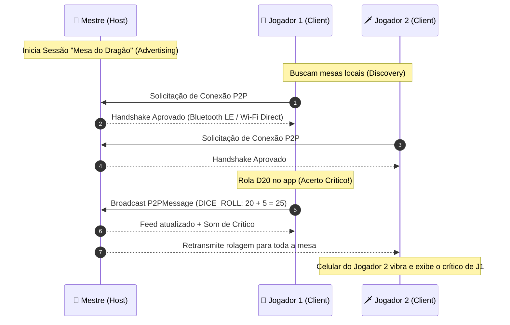
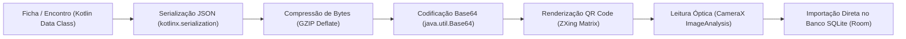
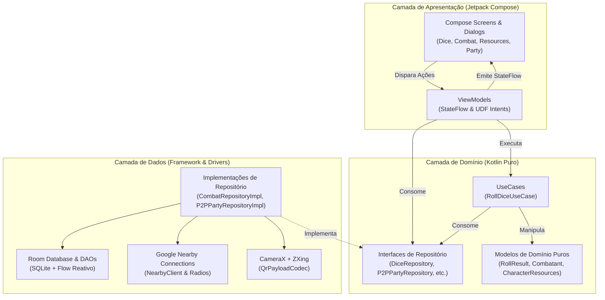

# 📜 Grimório RPG — Tabletop Companion for Android

<p align="center">
  
  
  
  
  
  
</p>

---

## 🧭 Visão Geral

O **Grimório RPG** é um aplicativo assistente completo para jogadores e mestres de RPG de mesa (D&D 5e, Tormenta20, Pathfinder 2e, Call of Cthulhu, Vampiro e outros). 

Diferente de soluções convencionais que exigem conexões constantes e assinaturas de servidores em nuvem, o **Grimório RPG foi desenvolvido sob o princípio do custo zero de infraestrutura ($0 Cloud Cost) e privacidade total**:
- **100% Offline-First:** Todos os dados, fichas, histórico de rolagens e encontros são persistidos localmente no dispositivo via **Room SQLite**.
- **Mesa Local P2P:** Mestres e jogadores sentados na mesma sala se conectam diretamente via **Google Nearby Connections** (Bluetooth LE + Wi-Fi Direct) sem necessidade de roteador, dados móveis ou internet.
- **Compartilhamento Físico via QR Code:** Fichas de personagens e encontros inteiros de combate são exportados e importados instantaneamente através de códigos QR de alta densidade comprimidos com **GZIP**.

---

## 🌟 Funcionalidades Principais

```mermaid
mindmap
  root((Grimório RPG))
    🎲 Motor de Dados
      Parser DSL Matemático
      Vantagem & Desvantagem (kh/kl)
      Dados Explosivos (!)
      Histórico Reativo (Room)
      Feedback Háptico & SoundPool
      Macros & Atalhos Customizados
    ⚔️ Rastreador de Combate
      Iniciativa Dinâmica
      Controle de Rodadas e Turnos
      Gestão Ágil de HP
      Filtro Aliados / Inimigos / Neutros
    🧪 Gestor de Recursos
      HP com Absorção de Temp HP
      Grade de Slots de Magia (1 ao 9)
      Catálogo de 15 Condições D&D
      Duração Sincronizada em Turnos
    📡 Mesa P2P Local
      Google Nearby Connections
      Modo Mestre (Host) e Jogador (Client)
      Transmissão de Rolagens em Tempo Real
      Chat de Mesa Criptografado Local
    📱 Compartilhamento QR
      Compressão GZIP + Base64
      Leitor CameraX + ZXing Embutido
      Exportação Instantânea de Fichas
    🎨 Temas Dinâmicos
      Pergaminho Medieval
      Cyberpunk Neon
      Horror Cósmico AMOLED
```

---

### 1. 🎲 Motor de Dados & Feedback Imersivo
- **DSL de Expressões:** Avaliador léxico em Kotlin puro capaz de processar fórmulas como:
  - `1d20 + 5` (Rolagem padrão com modificador).
  - `2d20kh1` (Vantagem — *Keep Highest*).
  - `2d20kl1` (Desvantagem — *Keep Lowest*).
  - `4d6kh3` (Geração de atributos clássica).
  - `3d6!` (Dados explosivos — o valor máximo rola novamente e soma).
- **Sensory Engine:**
  - Efeitos sonoros reais de rolagem, cliques e fanáticos acertos críticos com baixa latência usando **`SoundPool`** nativo.
  - Padrões de vibração tátil (**`VibrationEffect`**) diferenciando falhas críticas (vibração contínua e pesada) de acertos críticos (pulsos rápidos triunfantes).
- **Macros Persistentes:** Salve atalhos de ataques ou feitiços com categorias e ícones (ex: ⚔️ *Espada Longa*, 🔥 *Bola de Fogo*, 🛡️ *Cura Curativa*).

---

### 2. ⚔️ Rastreador de Iniciativa & Combate
- **Fluxo de Rodadas:** Adicione combatentes com iniciativas calculadas ou manuais. A ordem é automaticamente recalculada com indicadores do combatente da vez.
- **Ações Rápidas de HP:** Botões de incremento e decremento rápido para dano e cura sem interromper o ritmo do combate.
- **Identificação Tática:** Separação visual por papéis: Aliados (Heróis), Inimigos (Monstros/Vilões) e Neutros (NPCs).

---

### 3. 🧪 Gestão de Recursos & Status de Condições
- **Pontos de Vida Inteligentes:** Sistema hierárquico onde **HP Temporário** absorve danos primeiro antes de atingir o HP Real.
- **Grimório de Magias:** Controle de espaços de magia do 1º ao 9º círculo com restauração em Descanso Curto e Descanso Longo.
- **Catálogo de 15 Condições Oficiais:**
  - *Abençoado, Acelerado, Agarrado, Amedrontado, Atordoado, Cego, Enfeitiçado, Envenenado, Incapacitado, Invisível, Paralisado, Petrificado, Sangrando, Surdo e Caído*.
  - Cada condição inclui descrição detalhada das penalidades e contadores decrescentes de turnos.

---

### 4. 📡 Mesa Local P2P (Google Nearby Connections)

A comunicação presencial entre aparelhos opera em topologia estrela (`Strategy.P2P_STAR`) via rádio híbrido local:



- **Zero Consumo de Dados:** Não requer internet, rede Wi-Fi externa nem chip celular ativo.
- **Log Centralizado:** O Mestre audita as rolagens de todos os jogadores na mesma tela em tempo real.
- **Chat de Mesa Embutido:** Envio de bilhetes secretos e mensagens locais sem sair do app.

---

### 5. 📱 Compartilhamento Offline via QR Code

Para trocar fichas ou monstros instantaneamente entre aparelhos sem emparelhar Bluetooth:



- A compressão com GZIP reduz o tamanho da carga útil em mais de **75%**, permitindo encapsular fichas ricas em um único código QR nítido e de leitura instantânea.

---

### 6. 🎨 Temas Visuais Dinâmicos (Material 3)

Alterne a ambientação gráfica a qualquer instante através do seletor visual:

| Tema | Identidade Visual | Paleta Dominante |
| :--- | :--- | :--- |
| 📜 **Pergaminho Medieval** | Fantasia sombria clássica, ouro antigo e runas arcanas | `#E5A93C` (Gold), `#9D4EDD` (Arcane), `#121216` (Deep Leather) |
| ⚡ **Cyberpunk Neon** | Distopia tecnológica de alta voltagem | `#00F0FF` (Cyan), `#FF007F` (Neon Pink), `#090A10` (Dark Grid) |
| 🐙 **Horror Cósmico** | Estética lovecraftiana e economia de bateria em painéis OLED | `#39FF14` (Acid Green), `#000000` (Pure AMOLED), `#B5179E` (Abyssal) |

---

## 🏛️ Arquitetura de Software

O projeto segue os princípios da **Clean Architecture**, combinando **MVVM** e **UDF (Unidirectional Data Flow)**:



### Principais Decisões de Engenharia
1. **Domínio 100% Livre de Android:** O pacote `domain` não possui nenhuma referência a classes do SDK Android (`android.*`), permitindo testes unitários ultrarrápidos executados na JVM em milissegundos.
2. **Abstração do Google Play Services (`NearbyClient`):** A classe nativa `NearbyConnectionsClient` implementa a interface `NearbyClient`. Dessa forma, o repositório `P2PPartyRepositoryImpl` pode ser testado com fakes determinísticos sem depender de emuladores ou serviços da Google.
3. **`java.util.Base64` vs `android.util.Base64`:** Usado o Base64 padrão do Java SE (nativo no Android API 26+), permitindo testes unitários puros no JUnit sem necessidade de Robolectric ou mocks pesados.

---

## 📂 Estrutura do Código-Fonte

```text
app/src/main/java/com/grimorio/rpg/
├── core/
│   ├── audio/                 # SoundPoolManager e SoundManager
│   ├── designsystem/          # Material 3 Theme, Color palettes e Typography
│   └── haptic/                # AndroidHapticManager e VibrationEffect
├── data/
│   ├── local/
│   │   ├── dao/               # Room DAOs (RollHistory, Macro, Character, Combat)
│   │   ├── database/          # AppDatabase (SQLite Room com TypeConverters)
│   │   └── entity/            # Tabelas do banco de dados local
│   ├── nearby/                # NearbyClient e NearbyConnectionsClient
│   ├── qr/                    # QrPayloadCodec (GZIP/Base64), Generator e Analyzer
│   └── repository/            # Implementações de repositório da camada Data
├── domain/
│   ├── model/                 # Modelos imutáveis (RollResult, Combatant, etc.)
│   ├── parser/                # DiceExpressionParser (Parser léxico e matemático)
│   ├── repository/            # Contratos de repositório (P2PParty, Combat, etc.)
│   └── usecase/               # Casos de uso (RollDiceUseCase)
└── presentation/
    ├── MainActivity.kt        # Entry point e gerenciador de abas de navegação
    ├── combat/                # CombatScreen, CombatViewModel e diálogos
    ├── components/            # Componentes reutilizáveis (DiceButton, ThemeSelector)
    ├── dice/                  # DiceScreen, DiceViewModel e histórico
    ├── party/                 # PartyScreen, PartyViewModel (Mesa P2P)
    ├── resources/             # ResourcesScreen, ResourcesViewModel (HP e magias)
    └── share/                 # ShowQrDialog e ScanQrDialog (CameraX)
```

---

## 🧪 Suíte de Testes Automatizados

O projeto conta com ampla cobertura de testes unitários na pasta `app/src/test/`:

| Test Suite | Alvo | O que valida |
| :--- | :--- | :--- |
| [`DiceExpressionParserTest`](app/src/test/java/com/grimorio/rpg/domain/parser/DiceExpressionParserTest.kt) | Parser Matemático | Expressões complexas, vantagens, dados explosivos e precedência de operadores. |
| [`DiceViewModelTest`](app/src/test/java/com/grimorio/rpg/presentation/dice/DiceViewModelTest.kt) | DiceViewModel | Seleção de dados, aplicação de bônus, histórico e acionamento de feedback sensorial. |
| [`DiceRepositoryImplTest`](app/src/test/java/com/grimorio/rpg/data/repository/DiceRepositoryImplTest.kt) | Persistência Room | Salvar e recuperar rolagens com limite de histórico reativo via Flow. |
| [`MacroRepositoryImplTest`](app/src/test/java/com/grimorio/rpg/data/repository/MacroRepositoryImplTest.kt) | Gerenciador de Macros | CRUD de macros e inserção de macros padrão na inicialização. |
| [`CharacterRepositoryImplTest`](app/src/test/java/com/grimorio/rpg/data/repository/CharacterRepositoryImplTest.kt) | Repositório de Ficha | Persistência de slots de magia, condições ativas e histórico de HP. |
| [`CombatRepositoryImplTest`](app/src/test/java/com/grimorio/rpg/data/repository/CombatRepositoryImplTest.kt) | Repositório de Combate | Reordenação por iniciativa, exclusão e rotação de rodadas. |
| [`CombatViewModelTest`](app/src/test/java/com/grimorio/rpg/presentation/combat/CombatViewModelTest.kt) | CombatViewModel | Avanço de turnos, aplicação de dano/cura e sons de combate. |
| [`ResourcesViewModelTest`](app/src/test/java/com/grimorio/rpg/presentation/resources/ResourcesViewModelTest.kt) | ResourcesViewModel | Modificação de HP com absorção de Temp HP, slots de magia e catálogo de status. |
| [`QrPayloadCodecTest`](app/src/test/java/com/grimorio/rpg/data/qr/QrPayloadCodecTest.kt) | Codec de Compressão | Ciclo completo de encode e decode GZIP+Base64 para Fichas, Monstros e Macros. |
| [`P2PPartyRepositoryImplTest`](app/src/test/java/com/grimorio/rpg/data/repository/P2PPartyRepositoryImplTest.kt) | Repositório P2P | Modos Host e Client, serialização de pacotes de dados e broadcast. |
| [`PartyViewModelTest`](app/src/test/java/com/grimorio/rpg/presentation/party/PartyViewModelTest.kt) | PartyViewModel | Estados de conexão, chat local de mesa e reações sonoras a críticos remotos. |

Para rodar todos os testes unitários:
```bash
./gradlew testDebugUnitTest
```

---

## 🚀 Como Executar o Projeto

### Pré-requisitos
- **Android Studio:** Koala (2024.1+) ou versão superior.
- **JDK:** OpenJDK 17, 21 ou 22.
- **Dispositivo ou Emulador:** Android 8.0+ (API Level 26 ou superior).

### Passo a Passo
1. Clone o repositório:
   ```bash
   git clone https://github.com/FelipeGardenghiDev/rpg-companion-android.git
   ```
2. Abra a pasta `rpg-companion-android` no Android Studio.
3. Aguarde o Gradle sincronizar todas as dependências automaticamente.
4. Conecte um aparelho físico (recomendado para testar Nearby Connections e Câmera) ou inicie um Emulador com API 26+.
5. Pressione **Run (`Shift + F10`)**.

---

## 💼 Destaques para Portfólio & Engenharia

- **Engenharia de Rádio Local:** Domínio de comunicação mesh e peer-to-peer sem depender de WebSockets, Firebase ou servidores intermediários.
- **Otimização de Hardware:** Uso eficiente de `CameraX` e renderização de matrizes ZXing com baixa pegada de memória.
- **Imersão Multissensorial:** Engenharia de áudio com síntese de baixa latência (`SoundPool`) e formas de onda hápticas personalizadas (`VibrationEffect`).
- **Arquitetura Escalável:** Código testável, desacoplado, com injeção de dependências limpa e total separação de conceitos.

---

## 📄 Licença

Distribuído sob a licença **MIT**. Consulte [`LICENSE`](LICENSE) para mais detalhes.

<p align="center">
  Desenvolvido com dedicação por <b>Felipe Gardenghi</b> 🎲✨
</p>
